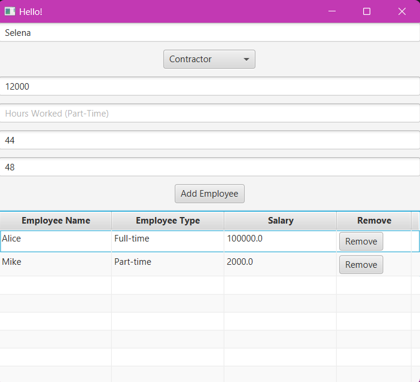
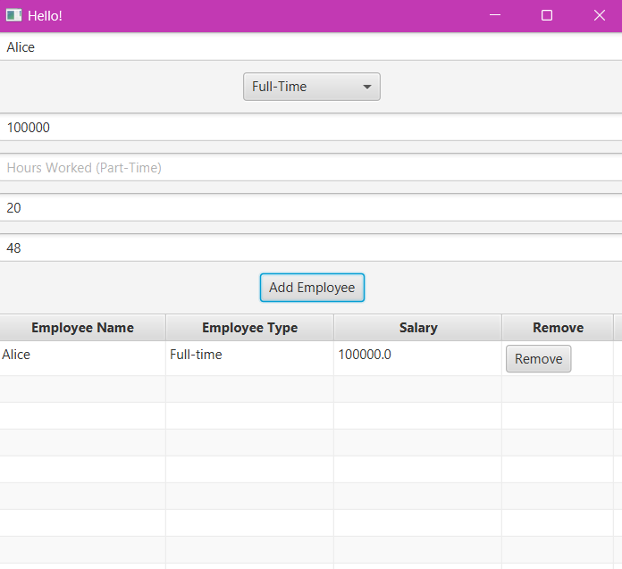
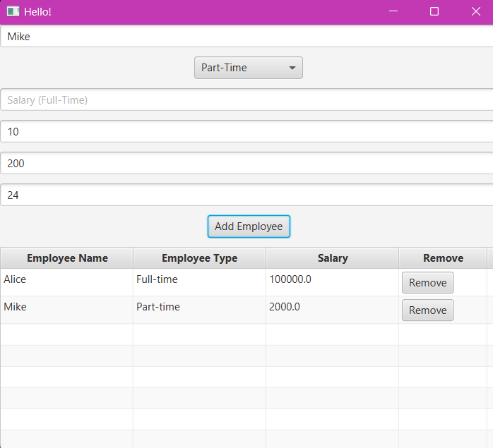
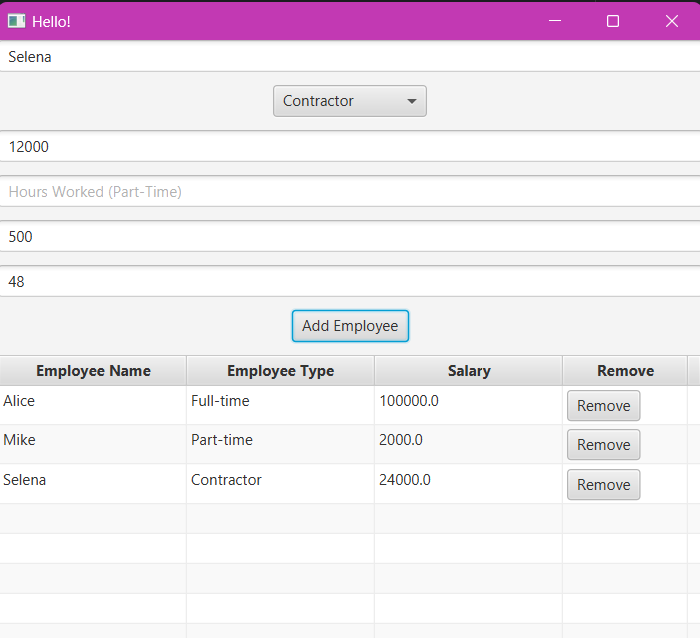

# Employee Management System

## Description
The **Employee Management System** is a JavaFX-based application designed to manage employees and calculate their salaries based on the type of employment. The application includes three types of employees:
1. **Full-Time Employee**: Has a fixed annual salary.
2. **Part-Time Employee**: Earns an hourly wage based on the number of hours worked.
3. **Contractor**: Works on a fixed hourly rate with a maximum number of hours they can work in a month.

The system allows users to:
- View a list of employees.
- Add new employees.
- View the calculated salary for each employee.
- Calculate salaries based on the type of employee.
- Remove employees from the list.

## Features
- **Employee List**: A table that displays employee details, including name, type, and calculated salary.
- **Employee Types**: Dropdown selection to choose between Full-Time, Part-Time, and Contractor employees.
- **Salary Calculation**: Automatically calculates the salary for each employee based on their type.
- **Validation**: Ensures valid input (e.g., non-negative hours, positive salary).
- **Remove Employees**: Option to remove employees from the list.

## Technologies Used
- **JavaFX**: For building the graphical user interface.
- **FXML**: For designing the layout of the application.
- **Maven**: For project management and dependencies.

## How to Run the Program

### Prerequisites
- Java 11 or later
- JavaFX SDK (if not included in your IDE)
- Maven (for building the project)

### Running the Application
1. Clone this repository to your local machine:
   ```bash
   git clone https://github.com/yourusername/Employee-Management-System.git
   ```
   
2. Navigate to the project directory:
   ```bash
   cd Employee-Management-System
   ```

3. If you don't have Maven installed, use the following commands to run the application (assuming JavaFX is correctly set up):
   ```bash
   mvn clean install
   mvn javafx:run
   ```

4. Alternatively, if using an IDE like IntelliJ IDEA or Eclipse:
   - **IntelliJ IDEA**: Open the project, right-click on the `HelloApplication.java` file, and select **Run**.
   - **Eclipse**: Import the project and run `HelloApplication.java`.

## Screenshots of the GUI

Here are screenshots showcasing the GUI of the **Employee Management System**:







(You can replace these links with your own screenshots.)

## Sample Inputs

Here are some sample inputs for each type of employee:

### Full-Time Employee:
- **Name**: John Doe
- **Type**: Full-Time
- **Salary**: $60,000 (Fixed Annual Salary)

### Part-Time Employee:
- **Name**: Jane Smith
- **Type**: Part-Time
- **Hours Worked**: 20 hours/week
- **Hourly Rate**: $25/hour

### Contractor:
- **Name**: Bob Johnson
- **Type**: Contractor
- **Max Hours**: 100 hours/month
- **Hourly Rate**: $30/hour

## License
This project is licensed under the MIT License - see the [LICENSE](LICENSE) file for details.
